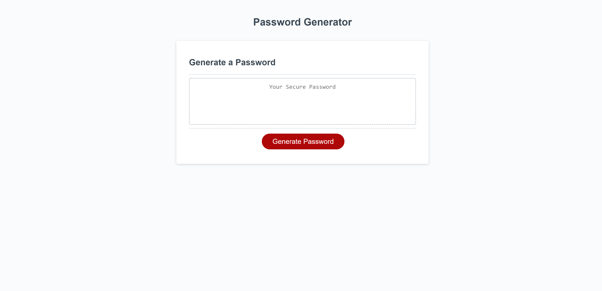
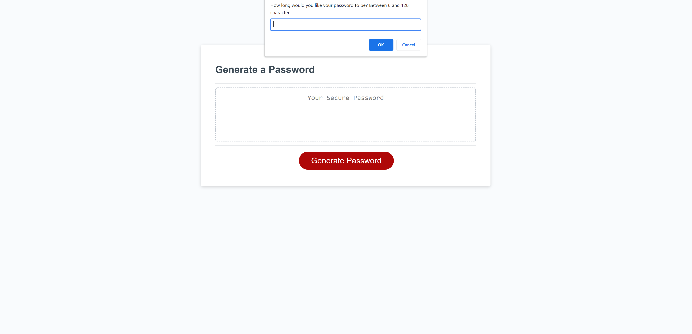
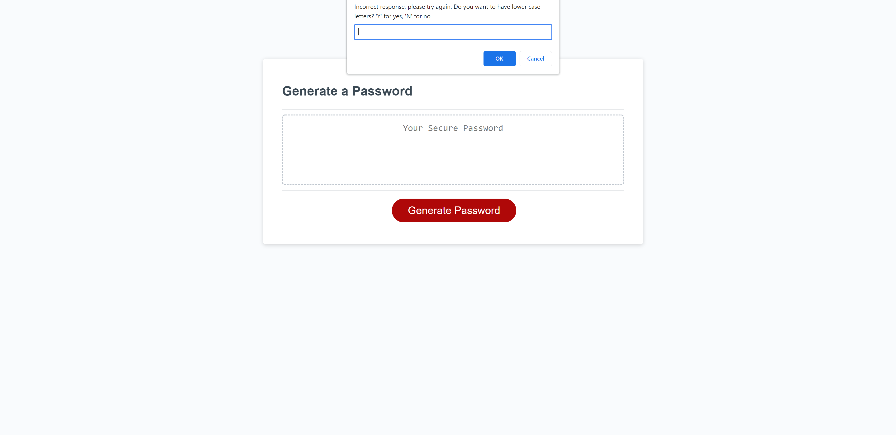
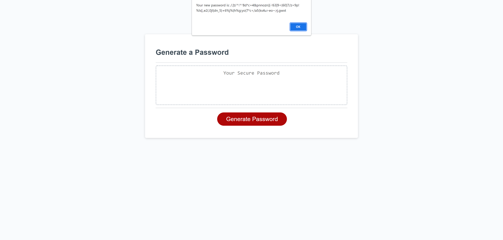
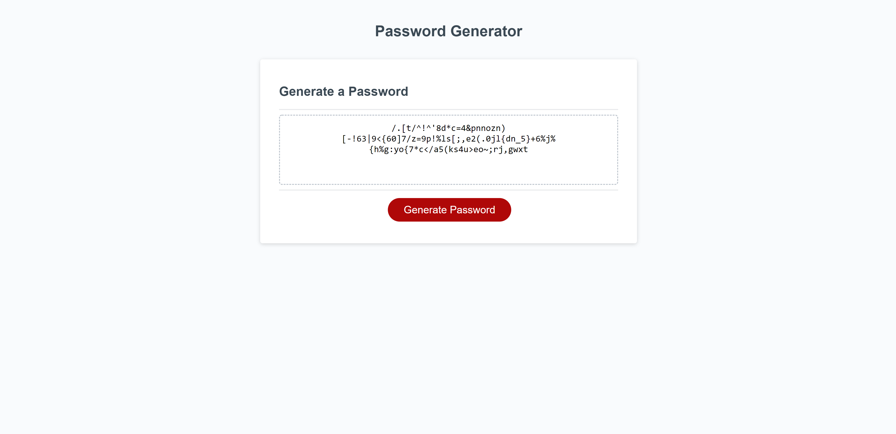

About the project:
The goal of this project was to create a password generator. All the user has to do is click the generate button and then enter in their preferences. The password is then generated to their specifications, with as much randomness as possible. The randomness is done using a random number generator that is selecting from every available character based on what the user selected.

Built using:
HTML CSS and Javascript

Usage:
The user will need to click the generate button, at that point they will be prompted to answer a few question:
They first need to specify the length of their desired password. It needs to be more than 7 and less than 129. If the user enters a number that is outside of that range, or enters in a letter, they will be prompted to retry.
After that they will have four different prompts. Each prompt asks if they would like to use one of the following, lower case, upper case, numeric values, and special characters. The user has to select yes or no using "Y", "y", "N", or "n". If the user does not select one of those values they will be prompted to try again. If the user does not select any character types they will be prompted to start the process all over again. 
Once the user has selected their specifications a password will pop up in an alert and in the text area.

Images:

This image shows the website when you first load it

After first clicking the button the user is prompted to enter in a number

If the user enters in an invalid input they will be told that they need to try again. In this example they need to answer yes or no to if they want to use a certain character set

Once all of the specifications are set the password will pop up in an alert box

After the alert has been exited the password will also be in the text area

The deployed website can be found at:
https://nileshachmeister.github.io/week3homework/

Sources:
https://www.youtube.com/watch?v=PkZNo7MFNFg&t=11052s
I used this for help on how to create a random number generator

https://sebhastian.com/javascript-array-string/
I used this to figure out how to take an array and turn it into a string

